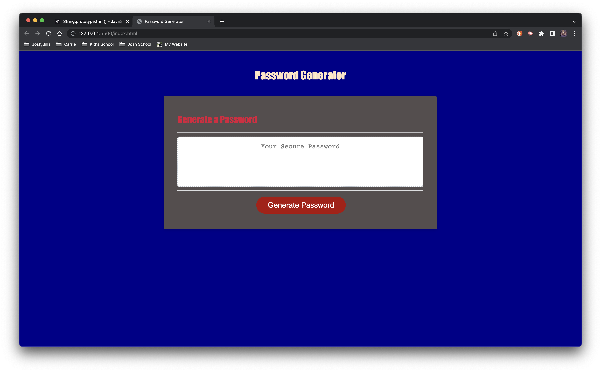

# 03 JavaScript: Password Generator

## My Task

This week's Challenge required us to modify starter code to create an application that enables employees to generate random passwords based on criteria that they’ve selected. This app will run in the browser and will feature dynamically updated HTML and CSS powered by JavaScript code that I wrote. It has a clean and polished, responsive user interface that adapts to multiple screen sizes.

## Mock-Up

The following image shows the web application's appearance and functionality:

## Review

I am submitting the following for review:

* The URL of the deployed application.

* The URL of the GitHub repository, with a unique name and a readme describing the project.